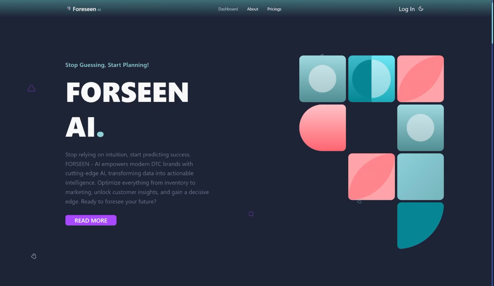
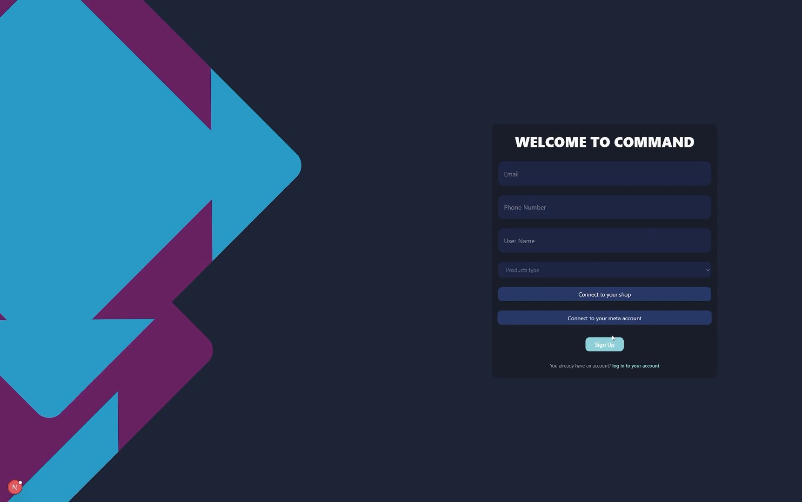
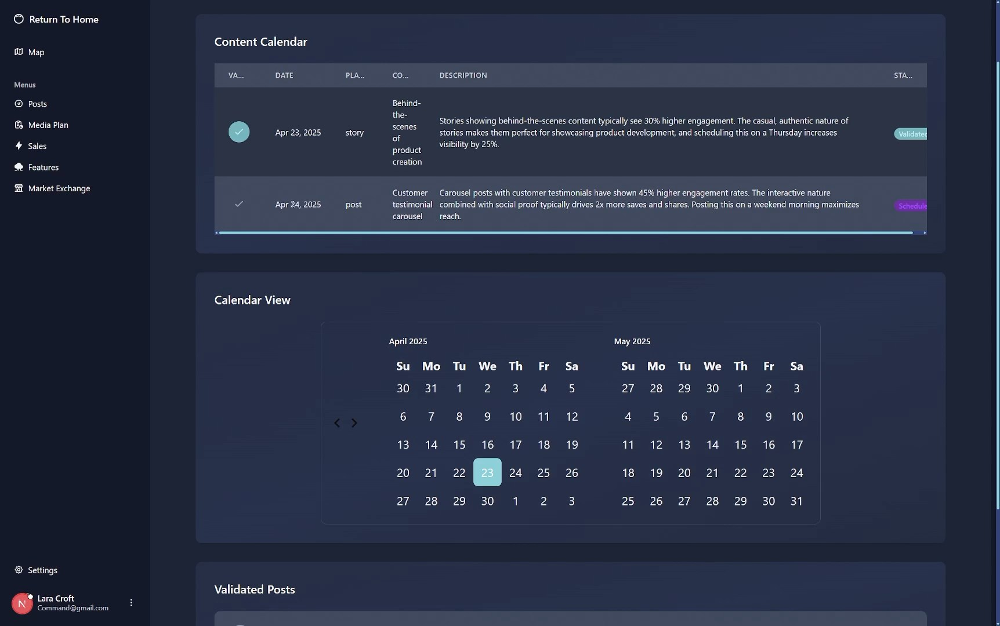
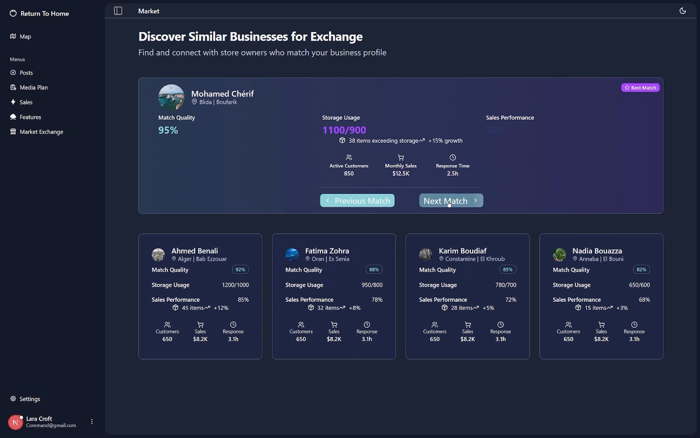
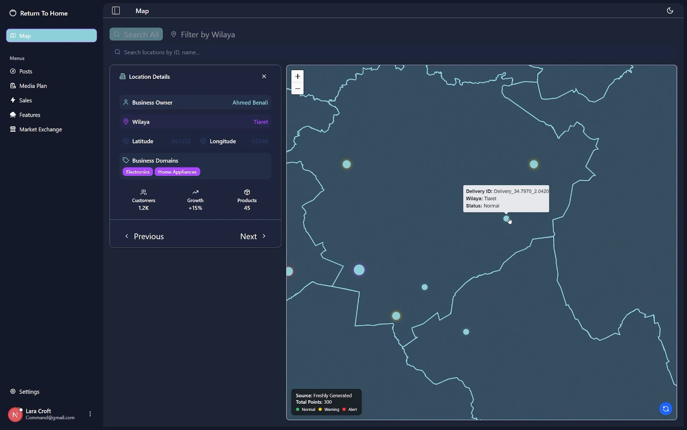
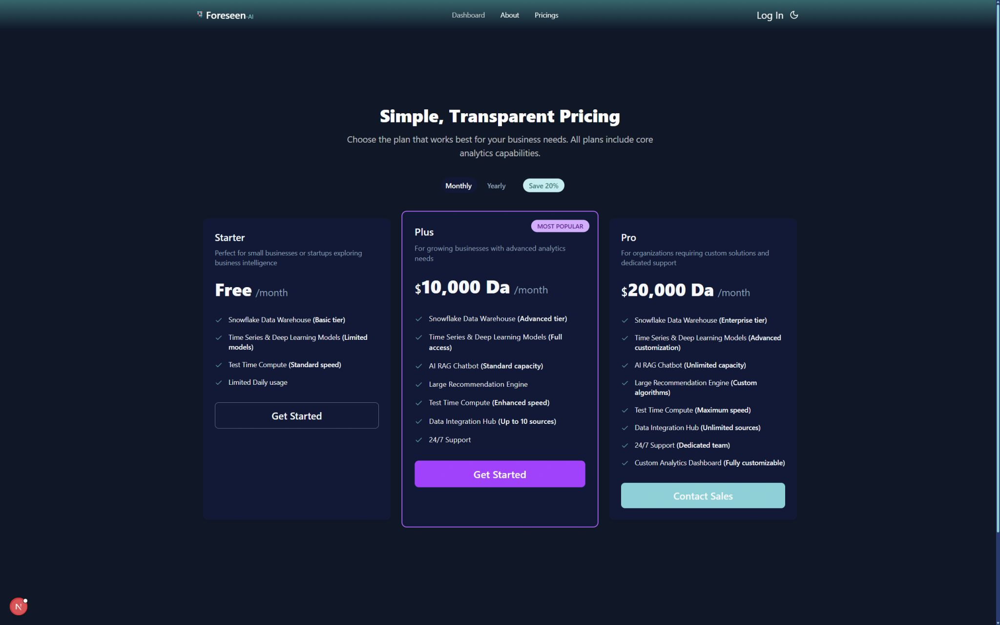
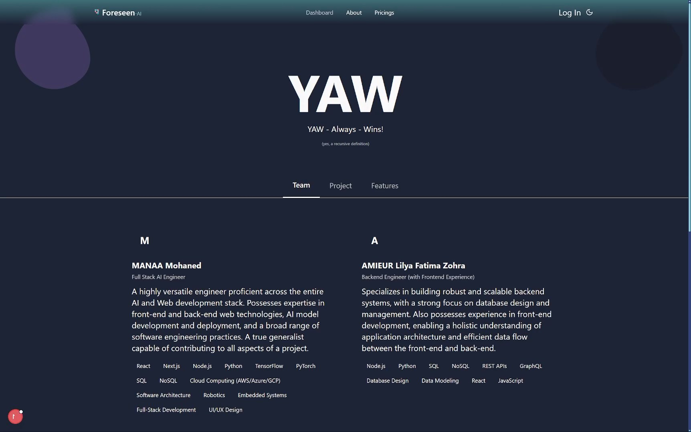

<h1 style="font-family: Arial, sans-serif; font-size: 36px; color: #4F46E5; display: flex; align-items: center; border-bottom: 3px solid #4F46E5; padding-bottom: 5px;">
    
    FORSEEN: Data-Driven Forecasting for DTC Brands 🔮
</h1>

FORSEEN is an intelligent, AI-powered platform built to help Direct-to-Consumer (DTC) businesses forecast sales, optimize inventory, collaborate with compatible brands, and make smarter decisions using real-time + historical data.

Built with **React**, **Tailwind**, **Supabase**, **Snowflake**, and a robust **RAG architecture** powering insights, forecasts, and strategy generation.

---

## Tech Used 🧑‍💻


---

## Core Features ⚡

* 📊 **Smart Sales Forecasting**
  Detects trends, predicts demand, and alerts businesses about overstock and understock.

* 🔁 **Client Matching Engine**
  Connects overstocked businesses with understocked partners for inventory balancing.

* 🤖 **AI Assistant (RAG-Powered)**
  Answers sales questions, builds marketing plans, and provides personalized strategic advice.

* 🎯 **Recommendation Engine**
  Suggests best-selling items and cross-client strategies proven to generate results.

* 🧠 **BI & Historical Analytics**
  Snowflake-powered dashboards combining real-time and aggregated multi-client data.

---

## Screenshots 📸

<br>


**Landing / Hero:** High-level overview of the platform’s value.

<br>


**Login:** Clean and simple authentication for business owners.

<br>


**Sales Calendar:** Visualize trends and demand across time.

<br>


**Inventory Exchange:** Peer-to-peer product balancing between DTC brands.

<br>


**Market Map:** Geographic matching and trend visualization.

<br>


**Pricing:** Clear subscription tiers.

<br>


**About:** Mission, purpose, and background.

---

## Data Architecture 🏗️

```plaintext
Supabase (Recent Data, Real-time)
        │
        ├── Incremental Sync
        ▼
Snowflake (Historical + Cross-Client Data)
        │
        ├── RAG Retrieval Layer
        ▼
AI Models (Forecasting, Marketing Strategies, Q&A)
```

* **Supabase** → Fast-access recent memory
* **Snowflake** → Scalable warehouse for long-term BI
* **RAG Layer** → Retrieves the right chunks of data
* **AI Models** → Generate forecasts, strategies, insights

---

## Project Structure 📂

```plaintext
src/
├── components/       # UI components
├── pages/            # Screens and routes
├── hooks/            # Forecasting, RAG, logic
├── services/         # AI, recommendations, API
├── db/               # Supabase & Snowflake utils
└── styles/           # TailwindCSS

ai/
├── forecasting/      # Demand prediction models
├── rag/              # Retrieval system
└── strategies/       # Marketing & sales generators
```

---

## Setup & Development 🛠️

1. **Clone:**

   ```sh
   git clone https://github.com/mohaneddz/Dev-Camp.git
   cd forseen
   ```

2. **Install:**

   ```sh
   pnpm install
   ```

3. **Run dev:**

   ```sh
   pnpm run dev
   ```

4. **Configure environment (.env):**

   * Supabase URL & keys
   * Snowflake credentials
   * Model endpoints

---

## Roadmap 🗺️

### Phase 1 — MVP

* [x] Forecasting
* [x] Alerts
* [x] RAG Assistant
* [x] Dashboard


---

## License ⚖️

MIT License — see `LICENSE`.

---

## Contact 📬

**GitHub:** mohaneddz
**Email:** [mohaned.manaa.dev@gmail.com](mailto:mohaned.manaa.dev@gmail.com)